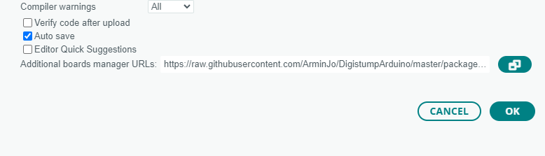
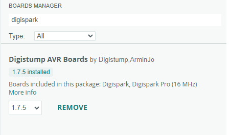
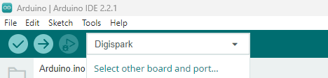
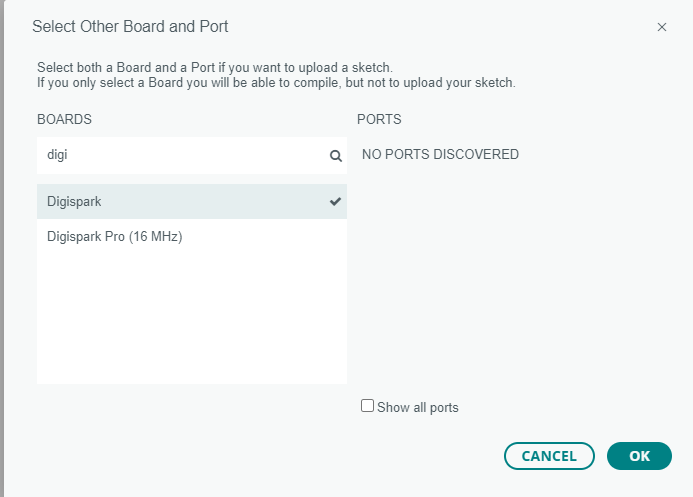
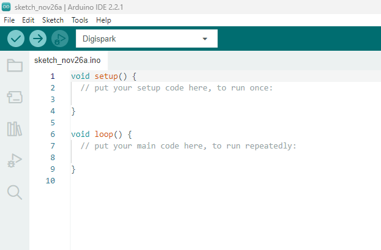

# Get your Attiny85 ready
## Install the drivers

- We need the [digistump drivers](https://github.com/digistump/DigistumpArduino/releases){:target="_blank"}
- Download the zip, unpack it and run the “install drivers” exe

## Install & setup the IDE

Download and install the [Arduino IDE](https://www.arduino.cc/en/software){:target="_blank"}.

Go to File > Preferences > Additional Boards Manager URLs and copy paste the url below.



```
https://raw.githubusercontent.com/ArminJo/DigistumpArduino/master/package_digistump_index.json
```

Go to Tools > Board > Boards Manager, ​search for Digispark and install “Digistump AVR Boards”​



Lastly, we will have to select the board that we're going to use in this workshop.



Using the filter, you should be able to find the digispark board easily. 



Be sure to have the "digispark" selected whenever you create new "sketches" (this is how Arduino calls the little programs you make).



And you’re done!​
