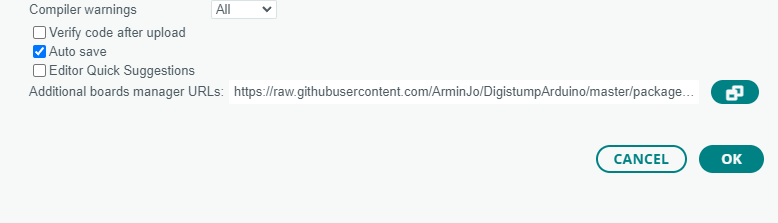

# Get your Attiny85 ready
## Install the drivers

- We need the [digistump drivers](https://github.com/digistump/DigistumpArduino/releases){:target="_blank"}
- Download the zip, unpack it and run the “install drivers” exe

## Install & setup the IDE

Download and install the [Arduino IDE](https://www.arduino.cc/en/software){:target="_blank"}.

Go to File > Preferences > Additional Boards Manager URLs and copy paste the url below.



```
https://raw.githubusercontent.com/ArminJo/DigistumpArduino/master/package_digistump_index.json
```

Go to Tools > Board > Boards Manager, ​search for Digispark and install “Digistump AVR Boards”​


And you’re done!​
