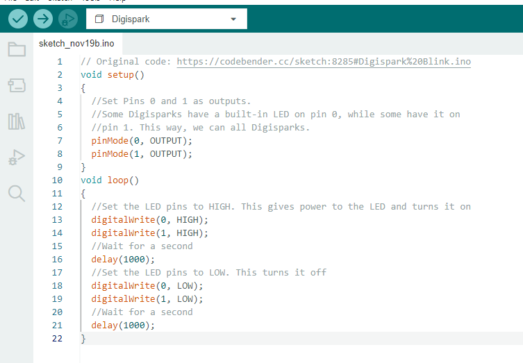
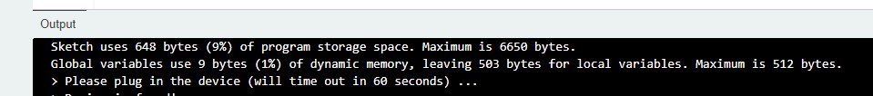
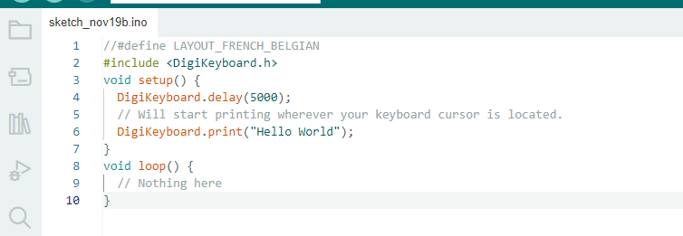
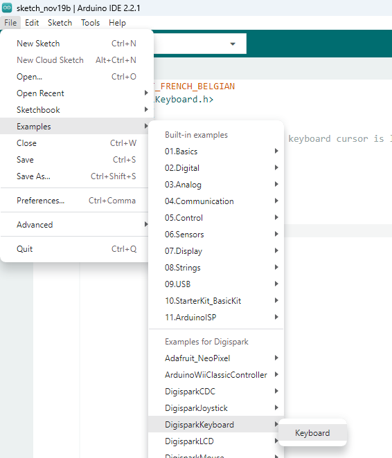
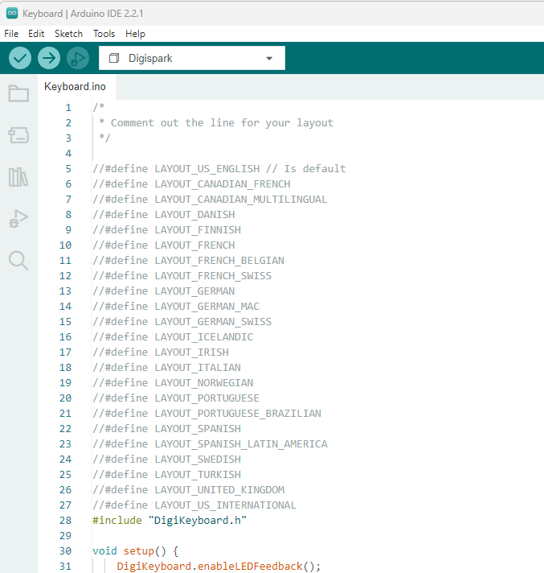

# Verification
To verify everything is setup correctly and that our little Attiny85 Arduino is working, we'll create 2  little sketches and run their code.

## Blink code

This sketch makes the led on your Arduino blink.

Copy paste the code below and upload it to your Attiny85. 

```c++
// Original code: https://codebender.cc/sketch:8285#Digispark%20Blink.ino
void setup()
{
	//Set Pins 0 and 1 as outputs.
	//Some Digisparks have a built-in LED on pin 0, while some have it on
	//pin 1. This way, we can all Digisparks.
	pinMode(0, OUTPUT);
	pinMode(1, OUTPUT);
}
void loop()
{
	//Set the LED pins to HIGH. This gives power to the LED and turns it on
	digitalWrite(0, HIGH);
	digitalWrite(1, HIGH);
	//Wait for a second
	delay(1000);
	//Set the LED pins to LOW. This turns it off
	digitalWrite(0, LOW);
	digitalWrite(1, LOW);
	//Wait for a second
	delay(1000);
}
```



Alternatively, you can also just load the Blink-program via the examples.


:warning: Keep in mind that you have to replug your Attiny85 whenever you upload new code. You can do this as soon as you see the text below appear.



Replugging the Attiny85 after uploading the code shouldn't be needed, but for some of the next exercises it's advisable if you don't see the expected results. As this device emulates a keyboard, if the user of the computer is doing other things at the same time, it might jumble up the keystrokes your computer registers. Don't be afraid to wait a couple of seconds!

## Hello World
This sketch will just start typing out "Hello world" wherever your cursor is, if it's in a location where it can type of course (notepad, search bar of your browser, ...).

This should already give you an idea on how 'intelligent' this little software is.

Copy paste the code below
```c++
//#define LAYOUT_FRENCH_BELGIAN
#include <DigiKeyboard.h>
void setup() {
  DigiKeyboard.delay(5000);
  // Will start printing wherever your keyboard cursor is located.
  DigiKeyboard.print("Hello World");
}
void loop() {
  // Nothing here
}
```



### Keyboard Layout

Azerty users will probably notice that "Hello World" is typed as "Hello Zorld". By removing the double slashes in front of ```#define LAYOUT_FRENCH_BELGIAN```, you can tell it to use the Azerty layout.

Arduino uses a Qwerty layout by default and we need to tell it explicitely if we want to use another one. Digispark has a Keyboard Layout Library with different layouts. If you want to find out which ones are available: you can look these up by loading in the keyboards sketch under "examples"



Feel free to toy around with this built in example to test out Keyboard Layouts



# Known issues
Issues might happen due to Windows not correctly recognizing the Attiny85-board, this prevents new code from being uploaded to the device. Extensive troubleshooting hasn't happened as to the exact cause but if your computer is using usb 3.X ports, it might help to have a usb-hub in between, especially if that one offers usb 2.X connectivity. This might be related to the way the Attiny85 is getting emulated on these ports.

Using the AVR Board manager 1.7.0 in stead of the 1.7.5 also solved the issue in 1 case. 

