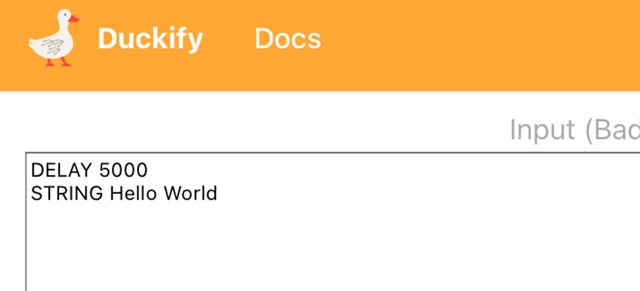

# :duck: Duckify your code
> If it looks like a duck, swims like a duck, and quacks like a duck, then it probably is a duck.

[Spacehuhn](https://spacehuhn.com/){:target="_blank"} made [this wonderful online convertor](https://duckify.huhn.me){:target="_blank"} helping you to write Arduino code. With his "Ducky script" you can use a very easy-to-learn syntax to write some more sophisticated code, also Spacehuhn project is made with the Arduino's memory limitations in mind, making sure your code runs properly.



Generate Arduino code using the online tool and upload this to your Arduino. Pay attention to the language settings on the bottom left corner.

No doubt, Spacehuhn was inspired to use a similar name to [the project](https://github.com/hak5/usbrubberducky-payloads){:target="_blank"} that made badUSB's infamous: the rubberducky

## Let's duckify more code
With this next piece of code, we'll get more into the possible functionality of our badUSB
```
DELAY 500
GUI R
DELAY 100
STRING POWERSHELL
DELAY 100
ENTER
DELAY 100
STRING get-childitem -recurse
DELAY 2000
ENTER
```
If everything goes well, code should be executed in a powershell terminal.

If something doesn't go well: try increasing the "DELAY" numbers from 100 to 1000, just to be safe. The Attiny85 doesn't understand what it is you're trying to do. The communication between it and your computer is purely one-directional.
- It just executes keystrokes.
- It doesn't get feedback from your computer when something goes wrong.

Don't be afraid to further tweak the DELAY numbers if needed to make it run optimally.

What did our code do ?

Hint: Maybe the [Microsoft documentation can](https://learn.microsoft.com/en-us/powershell/module/microsoft.powershell.management/get-childitem?view=powershell-7.4){:target="_blank"} tell us 😉
