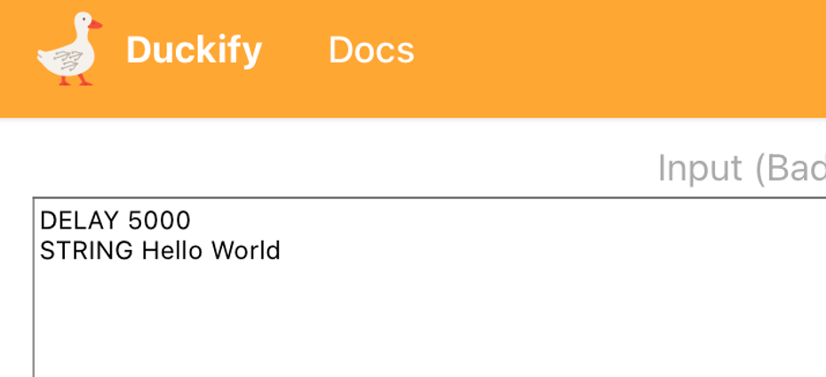

# Duckify your code
> If it looks like a duck, swims like a duck, and quacks like a duck, then it probably is a duck.

Spacehuhn made [this wonderful online convertor](https://duckify.huhn.me) helping you to write Arduino code. With his "Ducky script" you can use a very easy-to-learn syntax to write some more sophisticated code, also Spacehuhn project is made with the Arduino's memory limitations in mind, making sure your code runs properly.

Generate Arduino code using the online tool and upload this to your Arduino. Pay attention to the language settings on the bottom left corner.

No doubt, Spacehuhn was inspired to use a similar name to [the project](https://github.com/hak5/usbrubberducky-payloads) that made "Bad USB's" infamous: the rubberducky
