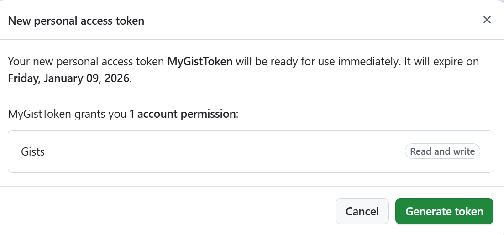
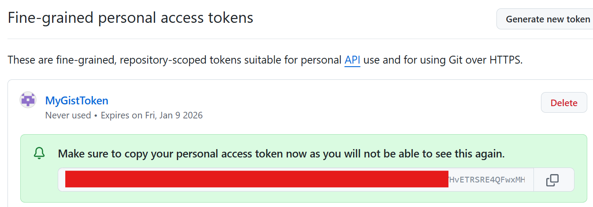

# Github gists
When multiple people are uploading code snippets to Pastebin from the same network (and same public IP address), we observed some sort of rate-limiting. After a few uploads we are unable to create new pastebins. That's why an alternative is presented here, using Github gists.

Go to [Github](https://www.github.com/){:target="_blank"} and create a free account.

## Get your Github API key
To be able to send your data to Github, you'll need an API-key. To get one, follow Github's own [tutorial](https://docs.github.com/en/authentication/keeping-your-account-and-data-secure/managing-your-personal-access-tokens#creating-a-fine-grained-personal-access-token)

Make a fine grained personal access token, which has permissions to create and modify gists. Remember: don't lose this key and also don't share it with anyone!




Create a new file named logindata.ps1 file with the code below  and copy paste your fine grained personal access token into that file.

```powershell
$FGPAT     =   "PUT-FGPAT-HERE"
```