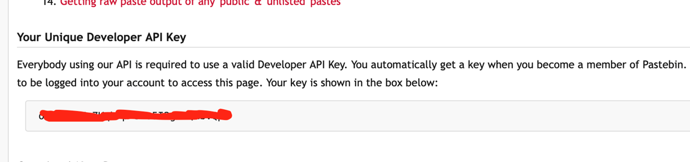

# Pastebin
[Famous website](https://pastebin.com/){:target="_blank"} for “easy copy and paste”
- It's Used in a lot of data exfiltration in companies.
- Obviously, many opensource equivalents exist, so an actual hacker will host their own pastebin.

For our workshop, we will just use a free version right now.

Go to [pastebin](https://pastebin.com/){:target="_blank"} and create a free account.

## Get your API-key
On pastebin.com go to the API tab

Find your developer API Key, Never share this with anyone!




Create a new file named logindata.ps1 file with the code below  and copy paste your dev key into that file.

```powershell
$DevKey     =   "PUT-DEVKEY-HERE"
$UserKey    =   "PUT-USER-KEY-HERE"
```
You don't have a UserKey yet.
