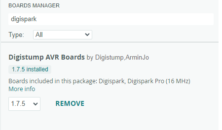

# Setup the IDE

Go to File > Preferences > Additional Boards Manager URLs and copy paste the url below.


```
https://raw.githubusercontent.com/ArminJo/DigistumpArduino/master/package_digistump_index.json
```

Go to Tools > Board > Boards Manager, ​search for Digispark and install “Digistump AVR Boards”​



And you’re done!​
